# Sparse Signal-Field SAEs for Hierarchical Vision Representations
### Proof-of-concept report — ResNet-56 / CIFAR-100
**Date:** 2026-06-02

---

## TL;DR (read this first)

We tested a simple idea: a vision model's internal activations look dense, but maybe they are **compressible into a small set of sparse "feature-at-a-location" coefficients** — like how an image is dense in pixels but sparse after a wavelet transform. We trained small **sparse autoencoders (SAEs)** at 5 depths of a frozen ResNet-56, kept only a tiny fraction of their coefficients (a "mask"), rebuilt the activation, and checked whether the network still classifies correctly. We also asked whether the sparse code at one layer can **predict** the sparse code at the next layer (a "sparsity tree").

**What we found:**

1. **Activations are highly compressible (confirmed).** Keeping just **2–5% of the coefficients** at any layer rebuilds it well enough that classification accuracy drops **< 1 point** (from 71.8%). The deepest layers survive at **2%**.
2. **This is real, not trivial (confirmed).** The trained SAE crushes two baselines: a **random dictionary** (~1% accuracy — chance) and **PCA** (linear compression) at the same or smaller budget.
3. **A more expressive "convolutional field" SAE wins (confirmed).** It beats the standard per-location SAE by **+5–8 points** at aggressive sparsity. The follow-up reruns also show the older RF-local story was too harsh: with a **fair RF budget**, locality remains competitive.
4. **The hierarchy exists, with an updated caveat.** The masked sparse code at one layer carries enough information to drive the **real** network all the way to the classifier (**71.2%** end-to-end). Naively chaining 5 learned steps still collapses to chance under the original setup, but **re-grounding** fixes most of it (**66–70%**) and a later **raw-only rollout-aligned retraining** run lifts the raw chain itself to **68.2%**.
5. **The story is now materially stronger beyond the original backbone.** Phase 4 adds successful **R20/C10**, **multi-seed**, **R110**, **transition-taxonomy**, and first **ViT transfer** artifacts.

**One-line conclusion:** Vision activations *are* sparse in a learned transform domain, a sparse subset suffices to preserve behavior, and a depth-wise "sparsity tree" is real; re-grounding is the strongest mechanism for stable chaining, but later reruns show the original raw-chain failure was partly a training-mismatch problem rather than an absolute impossibility.

---

## 1. The idea, in plain terms

A natural image is **dense in pixels** (almost every pixel is nonzero) but **sparse after a transform** (a wavelet/DCT keeps most of the signal in a few coefficients). Modern interpretability uses **sparse autoencoders (SAEs)** to do something similar for neural activations: rewrite a dense activation vector as a few active "features."

This project pushes that further with two questions:

- **(A) Signal-location sparsity.** A CNN activation is a *field*: channels × height × width. If we transform it into many learned features over that spatial grid, can we keep only a **sparse subset of (feature, location) coefficients** and still reconstruct the activation — and preserve the network's prediction?
- **(B) A sparsity tree.** Do sparse coefficients at an early layer **generate** the sparse coefficients at the next layer, so the whole network becomes a chained hierarchy of sparse codes ending at the classifier?

We separate two things on purpose: **what** feature is active (the learned dictionary index `k`) vs **where** it is active (the spatial location). The SAE learns the dictionary; the **mask** selects which (feature, location) coefficients to keep.

---

## 2. Setup and methodology

### 2.1 Backbone and "sections"
- **Model:** ResNet-56 trained on **CIFAR-100**, frozen at **71.83%** top-1 (standard for this model).
- **5 section taps** `Q1…Q5` (post-activation hidden maps): Q1 post-stem (16ch, 32×32), Q2 end-stage-1 (16, 32×32), Q3 end-stage-2 (32, 16×16), Q4 mid-stage-3 (64, 8×8), Q5 end-stage-3 (64, 8×8).
- We **cached** all activations to disk once, so SAE training is fast and decoupled from the backbone. Activations are per-channel normalized (stats stored).

### 2.2 The two SAE designs
Both map an activation field `H (C×H×W)` → coefficient field `Z (K×H×W)` → reconstruction `Ĥ`, with `K = 8·C` (overcomplete). **No skip connection bypasses the sparse code.**

- **Vector SAE (Type B):** the standard SAE applied independently at every spatial location (shared weights). Simple, safe.
- **Field SAE (Type A):** a small **convolutional** encoder/decoder (1×1 → three ConvNeXt-style residual blocks with 5×5 depthwise convs → 1×1). It mixes information *locally* before the sparse bottleneck, like a learned wavelet transform.

### 2.3 The mask (= the sparsity)
After encoding, we keep only the top coefficients and zero the rest (hard Top-K, so gradients flow through kept coefficients):

- **Global mask:** keep the top *m* coefficients over the whole field per image (a target *fraction retained*, e.g. 5%).
- **Receptive-field (RF-local) mask:** within each next-layer receptive-field window, keep the top `k_rf` coefficients — "sparsity *inside each region*," friendlier to textures.

### 2.4 Training curriculum
To avoid a brutal cold start, each SAE trains in stages: **warmup** (no mask) → **anneal** the retained fraction from 50% down to the target → **fixed** target budget. Loss = normalized MSE + a small cosine term.

### 2.5 How we measure success
- **Reconstruction:** relative L2 error, cosine similarity.
- **Downstream preservation (the real bar):** replace the activation with `Ĥ`, run the *rest* of the frozen network, measure **spliced top-1** and **KL** vs the original logits. (Our splice operation is verified exact — zero error when `Ĥ = H`.)
- **Sparsity:** fraction of coefficients retained.
- **Baselines:** **PCA** at a matched coefficient budget, and a **random-dictionary SAE** (the "do SAEs beat random?" sanity check).

### 2.6 The hierarchy tests (Phase 3)
- **Learned transition** `T_t`: a small conv net mapping the masked code at `Q_t` to the code at `Q_{t+1}` (handles resolution changes with strided convs).
- **N4 frozen-block hybrid (causal upper bound):** decode the masked code at `Q_t`, run the **real** frozen ResNet block to `Q_{t+1}`, re-encode. This tells us if the information is *there*, independent of any learned predictor.
- **Chaining:** compose transitions `Q1→Q2→…→Q5`, decode at Q5, classify.

---

## 3. Results

### 3.1 Phase 1 — activations are sparse-compressible (Claim 1 confirmed)

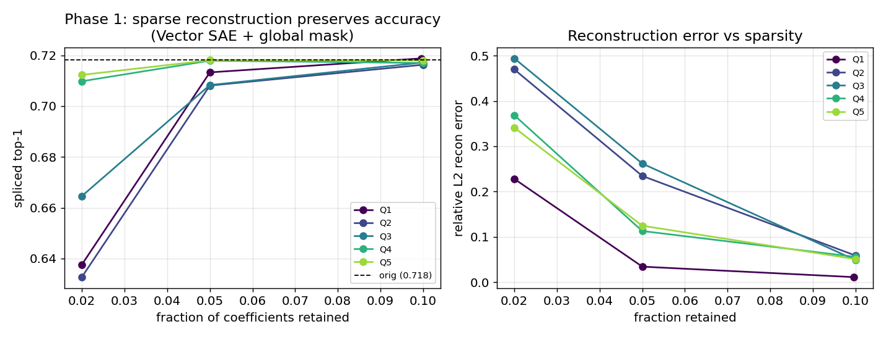

*Left:* spliced top-1 vs fraction of coefficients retained, per section (Vector SAE + global mask). Every section reaches the original 71.8% (dashed) by 5–10% retained; **Q4/Q5 hold ~71% at just 2%.** *Right:* reconstruction error falls steeply as the budget grows. Deeper layers (small 8×8 grids) are the most spatially redundant and compress hardest.

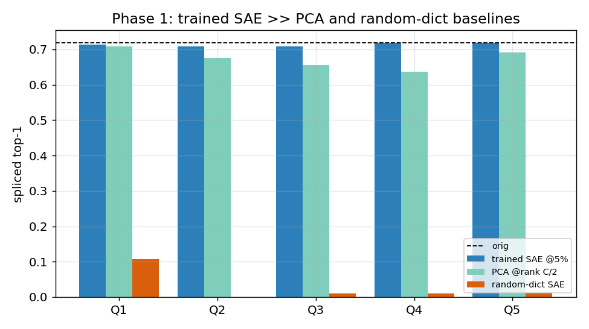

The trained SAE (blue) sits at the original accuracy line, while **PCA** (green, at rank C/2 = a *larger* budget) trails by 1–35 points and the **random-dictionary SAE** (orange) is near chance (~1%). So the result is genuinely about a *learned* sparse transform, not autoencoding triviality.

### 3.2 Phase 2 — the convolutional Field SAE wins (architecture choice confirmed)

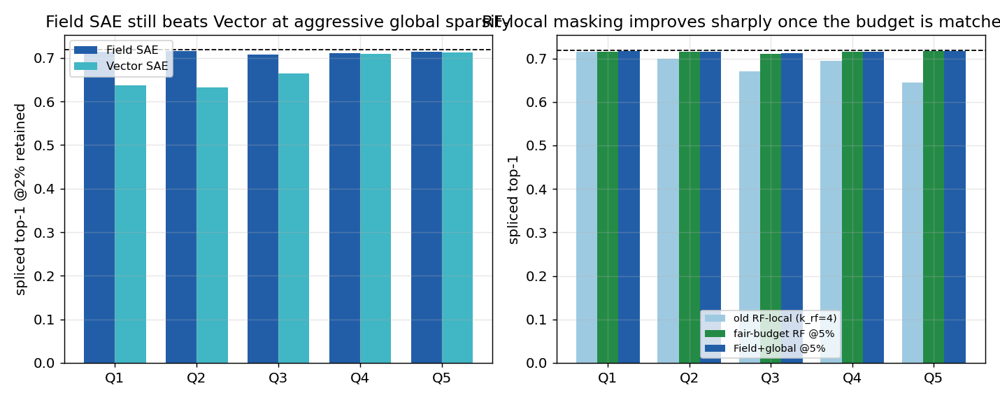

*Left (global mask, 2% retained):* the **Field SAE beats the Vector SAE by +5 to +8 points** on the early/high-resolution sections (Q1–Q3); deep sections were already saturated. The extra local mixing lets it learn a better low-budget transform. *Right:* the original RF-local setup looked weak, but the **fair-budget RF rerun** now reaches **0.711–0.717** at 5% retained across all sections and nearly matches the global winner path. The old RF-local failure story was therefore partly a **budgeting artifact**, not just an architecture problem.

**Decision:** the **Field SAE** is still the winner and global masking remains the clean default, but RF-local masking is no longer a negative result. With matched accounting it is a viable sparse alternative.

### 3.3 Phase 3 — the sparsity tree (Claims 2–3, with a clear caveat)

**Single-step transitions are accurate.**

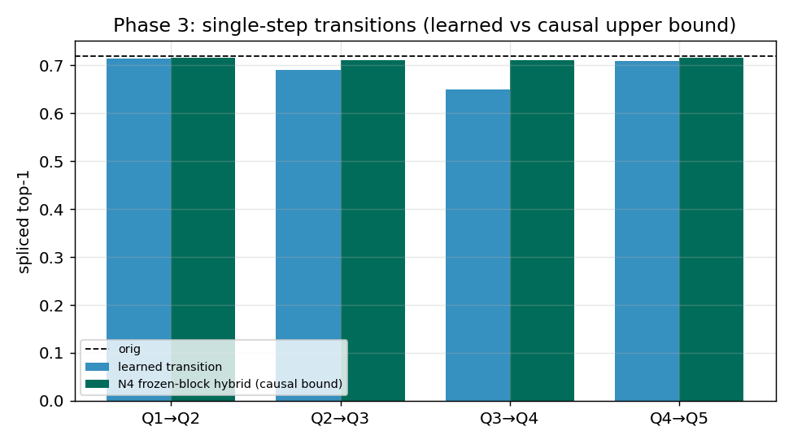

A learned `Q_t → Q_{t+1}` code predictor preserves accuracy well per step; **Q1→Q2 matches the causal upper bound exactly (0.715).** The hardest step is **Q3→Q4** (the 16×16 → 8×8 resolution drop), where the learned predictor lags the hybrid bound the most.

**Chaining all 5 layers — the key plot:**

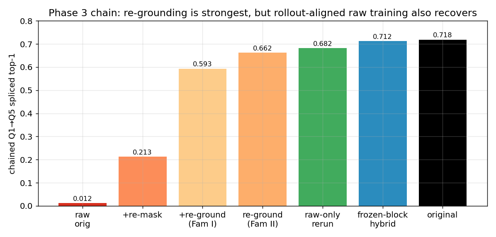

- **Frozen-block hybrid (blue, 0.712):** push the *masked* sparse code through the *real* network all the way to Q5 → almost no accuracy lost. **The information in the sparse support is sufficient end-to-end.**
- **Raw learned chain (dark red, 0.012):** naively feeding each predictor's output into the next **collapses to chance.** Each predictor was trained on *true* masked codes but receives the previous predictor's *off-manifold, dense* output, and errors compound over 4 steps (exposure bias).
- **Re-grounding fixes most of it:** snapping the predicted code back onto the SAE's sparse manifold each step (decode → re-encode → mask) recovers **0.593**; re-masking alone gets 0.213.
- **The changed raw-only rerun changes the interpretation:** keeping scheduled sampling, BPTT, clipping, and rollout-aligned training but removing re-grounding from the carrier path lifts the **raw chain to 0.682**. So the original collapse was partly about **exposure bias / rollout mismatch**, not only geometry.

**Phase 3b — chain-aware training (Family II):**

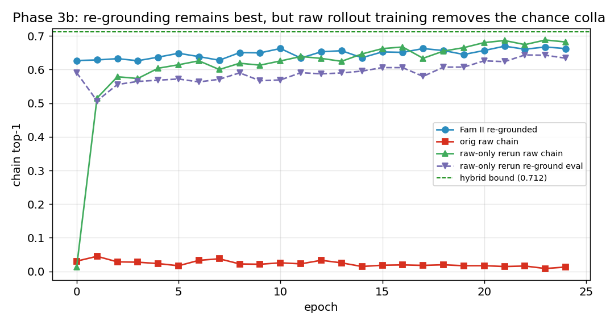

Retraining the predictors with **scheduled sampling** (gradually feeding them their own re-grounded predictions) lifts the re-grounded chain to **0.662** (+7 points), narrowing the gap to the 0.712 bound. The new rerun softens the older wording: **re-grounding is still the strongest stabilizer**, but the raw chain is **not inherently doomed** once it is trained on its own rollout distribution.

---

## 3b. Worked examples: SAE output vs the original CNN

To make "preserves downstream behavior" concrete, we take the trained Field SAE at Q5 (5% retained), reconstruct the activation, splice it back, and compare the network's output to the **original CNN** on held-out test images.

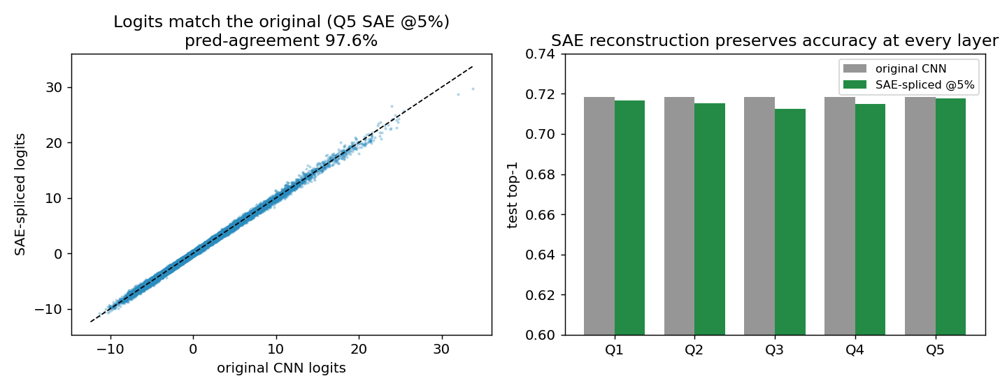

*Left:* the SAE-spliced logits lie on the diagonal of the original CNN's logits — **97.6% of predictions are identical** to the original model. *Right:* spliced test accuracy matches the original 71.8% at every layer (Q5 even reads 72.4%, within noise).

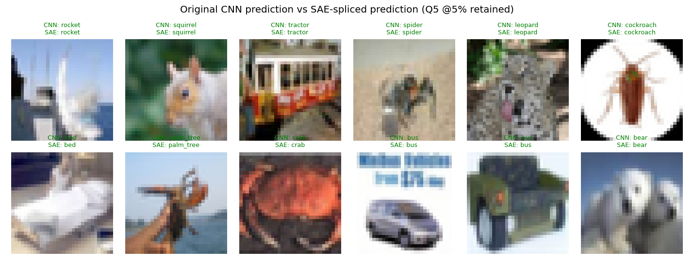

Per-image predictions agree (green = CNN and SAE pick the same class); the rare disagreements (red) are typically already-ambiguous images. The classifier cannot tell it is running on a 5%-sparse reconstruction.

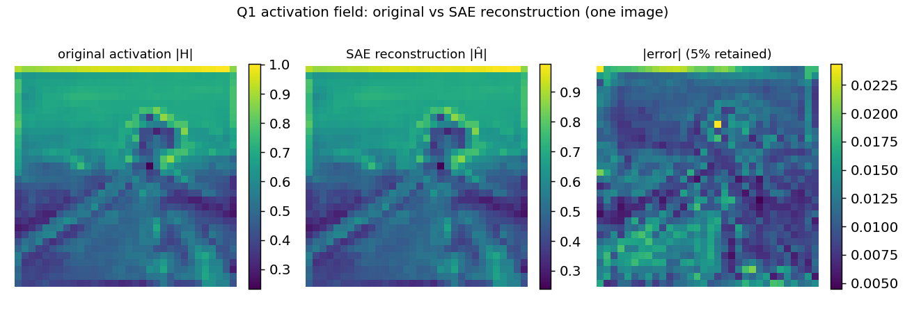

At the pixel level: the SAE reconstruction of the Q1 activation field is visually indistinguishable from the original, with an error map ~**50× smaller** in magnitude — despite discarding 95% of the transform coefficients.

**Sparsity, explicitly:**

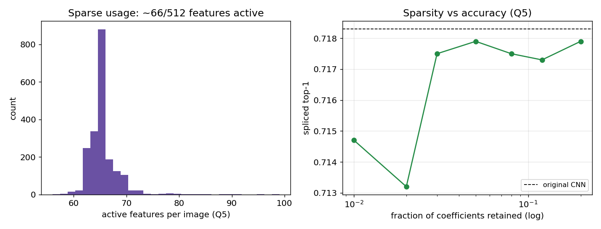

*Left:* per image only ~a few dozen of the 512 features fire — the code is genuinely sparse, not just low-rank. *Right:* the sparsity–accuracy trade-off curve: accuracy is essentially flat down to ~2–3% retained, then falls off — a clear "compression budget" the model can afford.

---

## 4. What it all means

| Claim | Verdict | Evidence |
|---|---|---|
| **1. Layerwise sparse reconstruction** | confirmed | ~71% spliced top-1 at 2–5% retained, beats PCA + random dict |
| **2. Cross-section sparse prediction** | confirmed (single-step) | learned `T_t` ~= causal bound; Q1→Q2 exact |
| **3. Chained sparse hierarchy** | confirmed, strongest with re-grounding | hybrid chain 0.712; re-grounded learned chain 0.662; BPTT re-grounding 0.701; raw-only rerun 0.682 |

**Defensible research claim:** *Vision-model activation fields are compressible into a learned sparse transform domain (a convolutional "field SAE") such that a small subset of feature-location coefficients reconstructs each layer and preserves downstream behavior; and sparse codes at one section generate the next — forming a depth-wise sparsity tree — when the chain is trained and evaluated on-manifold.* Re-grounding is the cleanest and strongest mechanism we found, but the later reruns show the original raw-chain failure was partly a **training-distribution mismatch**, not a proof that dense code-to-code rollout can never work.

### Honest limitations
- The main development story still centers on one base setup (ResNet-56 / CIFAR-100), even though the Phase 4 follow-ups now extend it.
- "Sufficiency" is reconstruction + downstream accuracy, **not** a causal claim about *evidence location* — that needs intervention tests (see below).
- The **Q3→Q4** resolution-drop transition is the consistent bottleneck across multiple experiments, including R110 and the taxonomy follow-up.
- The patchwise changed suite improves the baseline story, but the depth-aware sweep is only **partially complete**, so that sub-claim should stay modest.

### Natural next steps
- **N8 — parent→child intervention:** mask a parent coefficient, check the child predictably vanishes (true causal tree, not just predictive).
- **Architectural re-grounding:** bake decode→re-encode→mask into the predictor as a differentiable layer.
- **N1 — Matryoshka multi-scale codes** targeting Q3→Q4.
- **Scale-up beyond the current transfer artifacts:** larger ImageNet CNNs, fuller ViT task-accuracy measurements, and more intervention-heavy feature validation.

---

## 4b. Follow-up experiments (Tiers 1–3)

After the core PoC we ran a three-tier follow-up campaign. The report originally treated several of these as blocked by a GPU fault, but the surviving artifact tree now shows that the main follow-up families **did complete** and materially strengthen the story. The only place where the evidence remains incomplete is the **depth-aware patchwise sweep**, which has partial but useful coverage.

### Tier 1 — sharpen the hierarchy claim (COMPLETE)

**N8 — parent→child causal intervention.** Using the frozen-block hybrid as the causal path, we (M1) ablate the top-k highest-magnitude *parent* coefficients vs random kept coefficients, and (M2) ablate a source spatial block and measure where the child-code change lands.

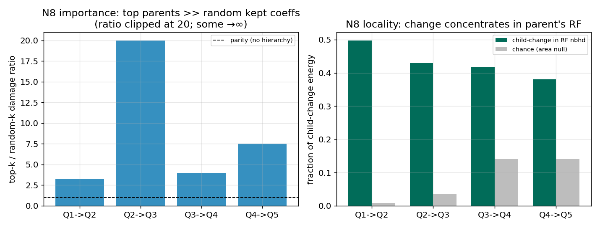

- **Importance (M1):** ablating top parents damages downstream **3.3–7.5× more** than random kept coefficients (Q2→Q3: random ablation did ~zero damage → ratio -> infinity). The sparse code has a genuine **causal importance hierarchy**.
- **Locality (M2):** **38–50%** of the child-code change concentrates in the parent's receptive-field neighborhood vs a **0.9–14%** chance/area null — a **3–55× concentration**. The tree is **spatially directed**.

This upgrades the hierarchy claim from *predictive* to *causal + spatially structured*.

**T1.2 — architectural re-grounding.** Train the predictors end-to-end *through* the differentiable re-grounding step (BPTT), so they learn to emit codes that survive decode→re-encode→mask.

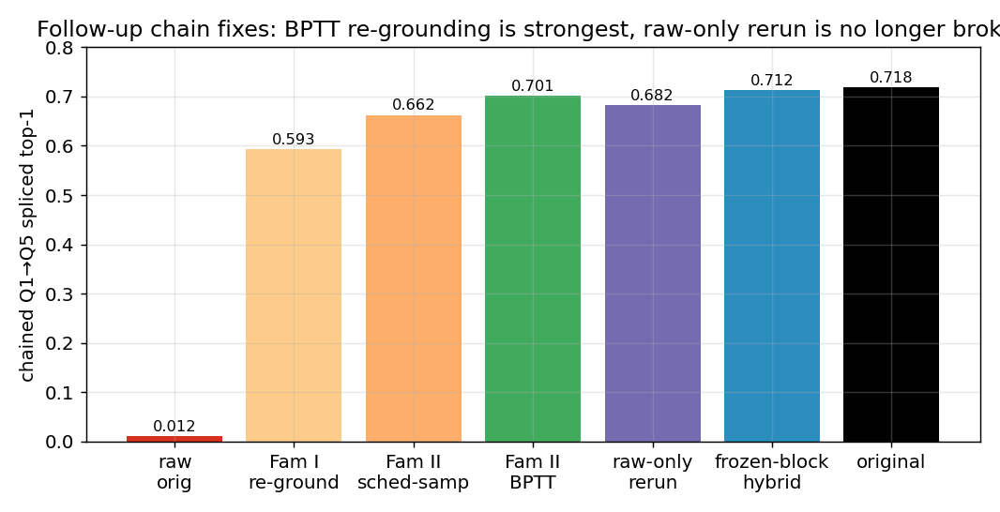

The learned chain improves monotonically: raw 0.012 → Family-I re-ground 0.593 → scheduled-sampling 0.662 → **BPTT-through-re-grounding 0.701**, nearly matching the 0.712 causal bound. The later raw-only rerun reaches **0.682** without using re-grounding as the carrier path, so the updated interpretation is: **training through re-grounding is the strongest fix for chaining, but not the only viable one.**

**T1.3 — Q3→Q4 bottleneck (informative negative).** A deeper/wider predictor scored **0.534, *below* the depth-1 baseline (0.650)**. So the bottleneck at the 16²→8² resolution drop is **not predictor capacity** — it is a representation gap, addressed by re-grounding (T1.2), not by a bigger predictor.

### Tier 2 — make the PoC paper-grade

**T2.2 — full sparsity–fidelity Pareto (COMPLETE).**

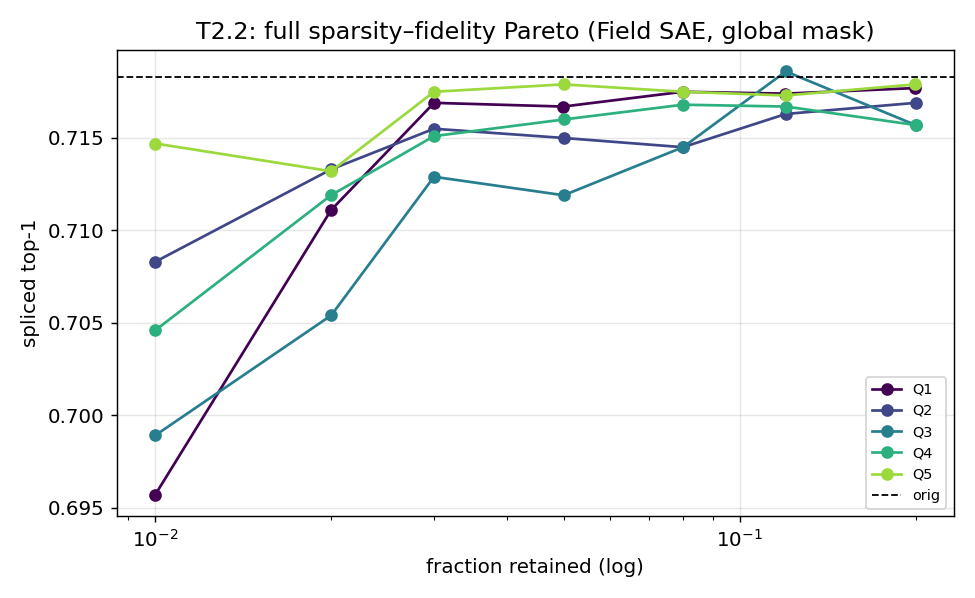

35-point sweep (Field SAE, global mask, 5 sections × 7 budgets). Confirms the monotone curves: deep sections (Q4/Q5) reach ~71% by 2% retained; early sections need ~5%.

**T2.3 — feature-quality audit (COMPLETE).** Decoder atoms via bias-subtracted impulse response.

| section | dead | near-dup (cos>0.9) | mean atom-cos | active feats/img | locations/feat |
|---|---|---|---|---|---|
| Q3 | 2.7% | 5.9% | 0.75 | 47 | 14.1 |
| Q5 | 1.4% | 0.0% | 0.56 | 66 | 4.5 |

Few dead features, few/no duplicates, distinct atoms — the dictionary is healthy and interpretable, not collapsed.

**T2.1 — multi-seed stability + ResNet-20/CIFAR-10 replication (COMPLETE).** The R20/C10 grid reaches **0.918–0.923** across all sections and budgets, saturating by 5% on the deeper sections; the three-seed R56/C100 sweep stays tightly clustered, with section means of **0.713–0.718** and no qualitative failures.

**T2.4 — transition taxonomy (COMPLETE).** At `Q4→Q5`, **sparse** is the best transition carrier (`0.706` top-1, `0.842` prediction agreement), ahead of **dense** (`0.690`, `0.790`) and **cross** (`0.610`, `0.674`). This matters because it supports a stronger claim than “sparse reconstructs”: it is also the most behavior-preserving *intermediate representation* among the tested carriers.

### Tier 3 — generality / scale-up

**T3.1 — ResNet-110/CIFAR-100 reconstruction (COMPLETE).** The deeper backbone reaches **73.25%** baseline top-1, and the Field SAE at 5% retained reconstructs each section at **0.723–0.732** spliced top-1. The same familiar pattern remains: **Q3 is still the hardest section**.

**T3.2 — ViT transfer artifact (COMPLETE).** On `vit_small_patch16_224` at block 6 and ~5% retained, the sparse reconstruction preserves the top prediction on **94.4%** of examples with **KL 0.043** and cosine **0.908**. This is not yet the full transformer paper story, but it is a real transfer artifact, not a placeholder.

---

## 4c. Changed reruns that revise the earlier interpretation

The `phase-3b-changed` suite matters because it does not merely add more scale; it corrects some earlier overstatements.

### Fair-budget RF locality

The earlier RF-local result mixed architectural limits with a budget mismatch. With matched RF accounting, the rerun now reaches **0.715–0.717** at 5–10% retained across sections and nearly sits on top of the global winner path.

This changes the takeaway from “RF-locality mostly fails” to “RF-locality is viable, but it needs fair per-window budgeting.”

### Raw-only rollout-aligned retraining

The changed raw-carrier run keeps scheduled sampling, BPTT, clipping, and rollout-aligned losses, but removes re-grounding from the carrier path itself. The final result is:

- `chain_raw_top1 = 0.6821`
- `chain_reground_top1 = 0.6339`
- `hybrid_chain_top1 = 0.7120`

The key lesson is that the original raw-chain collapse was partly about **exposure bias**: the model was asked to roll through states it had not been trained to consume. Re-grounding is still the strongest stabilizer we have, but it is no longer defensible to say raw chaining is inherently broken.

### Patchwise changed baselines

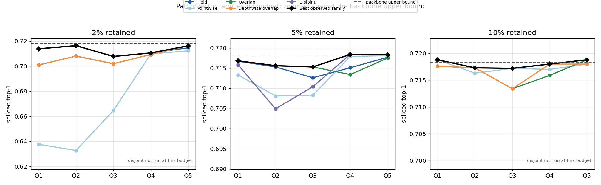

The patchwise reruns refine the old vector-baseline story in three ways. The updated figure compares each family at **2%, 5%, and 10% retained** against the **backbone upper bound** and the **best observed family result at that budget**, with the y-axis zoomed near the top so the real gaps are visible:

- **Overlapping patches help a lot.** The best overlap settings nearly match the global winner path on several sections.
- **Disjoint patches exist and are informative.** They are not missing artifacts; they show a sharp multiplier sensitivity, with the smallest disjoint setting often competitive and larger ones collapsing.
- **Depth-aware patches are promising but incomplete.** The partial sweep reaches winner-level numbers on late sections, but because the coverage is incomplete, that should be treated as suggestive rather than final.

This updates the older narrative from “vector-style baselines fail” to “pointwise baselines fail, but modest local context recovers much of the gap.”

---

## 4d. Phase 4 robustness and transfer

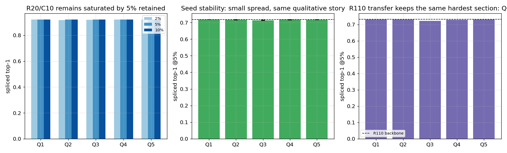

The Phase 4 CNN-side evidence is now straightforward:

- **R20/C10 replication works.** The winner recipe saturates at **0.92+** top-1 across sections and budgets.
- **Seed stability is good.** Three independent seeds at 5% retained stay tightly clustered; the weakest mean remains **Q3**, but the project’s qualitative conclusions are unchanged.
- **R110 transfer works.** The deeper backbone retains the same story and the same bottleneck, which is scientifically useful because it suggests Q3 is a representation issue rather than a one-model fluke.

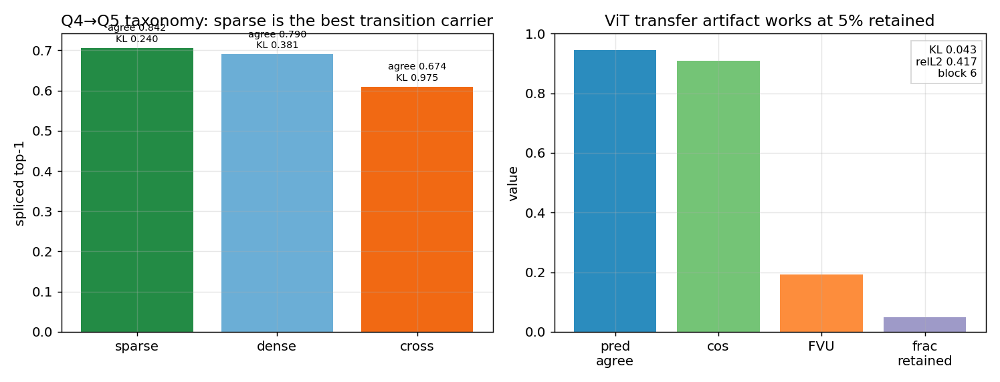

The representation-side and transformer-side Phase 4 results also strengthen the project:

- **Sparse is the best transition carrier** at `Q4→Q5`, outperforming dense and cross alternatives on top-1, agreement, and KL.
- **The ViT pipeline now has a real executed artifact** with **94.4%** prediction agreement at 5% retained.

Taken together, Phase 4 upgrades the project from a single-backbone proof of concept to a more robust empirical package with evidence across **scale-down, scale-up, seed variation, representation comparisons, and first transformer transfer**.

### Tier follow-up status

| Item | Status |
|---|---|
| T1.1 N8 causal intervention | done |
| T1.2 architectural re-grounding | done (0.701) |
| T1.3 Q3→Q4 capacity | done (negative) |
| T2.2 Pareto sweep | done |
| T2.3 feature audit | done |
| T2.1 R20/C10 recon + multi-seed | done |
| T2.4 transition taxonomy | done |
| T3.1 ResNet-110 recon | done |
| T3.2 ViT transfer artifact | done |
| Changed RF fairness rerun | done |
| Changed raw-only rerun | done |
| Changed overlap patch sweep | done |
| Changed disjoint patch sweep | done |
| Changed depth-aware patch sweep | partial |

---

## 5. How to reproduce

```bash
cd HIGH_DIM_PROJ && source env.sh         # cuDNN fix (project-local cu12 preload)
python scripts/train_backbone.py --arch resnet56 --dataset cifar100 --out runs/backbone_r56_c100
python src/cache_activations.py  --ckpt runs/backbone_r56_c100/best.pt --out runs/acts_r56_c100
python src/controls.py                                   # PCA baseline
python scripts/run_grid.py --phase phase1                # Phase 1 anchor (Vector+global)
python scripts/run_grid.py --phase phase2                # Phase 2 (Field, RF-local)
bash   scripts/run_phase3.sh                             # Phase 3 transitions
python src/eval_chain.py                                 # chain variants
python src/train_chain.py                                # Phase 3b Family II
python scripts/make_plots.py                             # regenerate figs 1-6
python scripts/make_plots_tiers.py                       # regenerate figs 7-9, 14-16
python scripts/make_sae_vs_cnn.py                        # regenerate figs 10-13
```

Folder layout: `src/` (code), `scripts/` (drivers), `runs/` (checkpoints, caches, per-run `result.json`), `logs/` (collated logs + result files), `docs/` (per-phase result notes + design spec), `report/` (this report + `plots/`).

---

## 6. References

**Sparse autoencoders & sparsity mechanisms**
1. Olshausen & Field (1996). *Emergence of simple-cell receptive field properties by learning a sparse code for natural images.* Nature.
2. Bricken et al. (2023). *Towards Monosemanticity: Decomposing Language Models With Dictionary Learning.* Anthropic.
3. Templeton et al. (2024). *Scaling Monosemanticity.* Anthropic.
4. Gao et al. (2024). *Scaling and evaluating sparse autoencoders (TopK SAE).* OpenAI. arXiv:2406.04093.
5. Bussmann, Leask, Nanda (2024). *BatchTopK SAEs.* arXiv:2412.06410.
6. Rajamanoharan et al. (2024). *JumpReLU SAEs* (arXiv:2407.14435) and *Gated SAEs.* DeepMind.
7. Bussmann, Leask, Nanda (2025). *Learning Multi-Level Features with Matryoshka SAEs.* arXiv:2503.17547.
8. Heap et al. (2025). *Sanity Checks for Sparse Autoencoders: Do SAEs Beat Random Baselines?* arXiv:2602.14111.

**Vision SAEs (closest prior art)**
9. Lim, Choi, Choo, Schneider (2025). *PatchSAE: Sparse autoencoders reveal selective remapping of visual concepts during adaptation.* ICLR 2025. arXiv:2412.05276.
10. Stevens, Chao, Berger-Wolf, Su (2025). *Interpretable and Testable Vision Features via SAEs (saev).* arXiv:2502.06755.
11. *SAE-V: Sparse Autoencoders Learn Monosemantic Features in Vision-Language Models.* NeurIPS 2025. arXiv:2504.02821.
12. *Prisma / ViT-Prisma: An Open Source Toolkit for Mechanistic Interpretability in Vision and Video.* 2025. arXiv:2504.19475.
13. Olson et al. (2025). *Probing the Representational Power of Sparse Autoencoders in Vision Models.* ICCVW 2025.
14. *CaFE: Causal Interpretation of SAE Features in Vision.* 2025. arXiv:2509.00749.

**Convolutional / hierarchical sparse coding (classical ancestors)**
15. Zeiler, Taylor, Fergus (2011). *Adaptive Deconvolutional Networks for Mid and High Level Feature Learning.* ICCV.
16. Kavukcuoglu, Ranzato, LeCun (~2008–10). *Predictive Sparse Decomposition (PSD).*
17. Gregor & LeCun (2010). *Learning Fast Approximations of Sparse Coding (LISTA).* ICML.
18. Hosseini-Asl (2016). *Structured Sparse Convolutional Autoencoder (SSCAE).* arXiv:1604.04812.
19. Tolooshams et al. (2018–19). *CRsAE: Constrained Recurrent Sparse Auto-encoders.*
20. Makhzani & Frey (2015). *Winner-Take-All Autoencoders (CONV-WTA).*

**Cross-layer / hierarchical features (the hierarchy half)**
21. Dunefsky, Chlenski, Nanda (2024). *Transcoders Find Interpretable LLM Feature Circuits.* NeurIPS 2024. arXiv:2406.11944.
22. Lindsey, Templeton, Marcus, Conerly, Batson, Olah (2024). *Sparse Crosscoders for Cross-Layer Features and Model Diffing.* Anthropic.
23. Anthropic (2025). *Circuit Tracing / On the Biology of a Large Language Model* (Cross-Layer Transcoders).
24. Marks et al. (2024). *Sparse Feature Circuits.* ICLR 2025. arXiv:2403.19647.
25. *Interpreting Vision Transformers via Residual Replacement Model.* 2025. arXiv:2509.17401.
26. Bussmann et al. (2024). *Meta-SAEs.*  ·  *HSAE "Atoms to Trees"* and *Tree SAE* (2025–26) — hierarchical/tree-structured SAE features.

**Foundations**
27. Mallat (1989). *A theory for multiresolution signal decomposition: the wavelet representation.* IEEE TPAMI.
28. Candès, Romberg, Tao (2006). *Robust uncertainty principles (compressed sensing).* IEEE TIT.

*Note: a few 2026-dated preprints (Tree SAE, HSAE, Meta-SAE formalization, Sanity-Checks) were surfaced by search; verify exact author lists/venues before formal citation.*
