# Sparse Signal-Field SAEs for Hierarchical Vision Representations
### Proof-of-concept report — ResNet-56 / CIFAR-100
**Date:** 2026-05-31

---

## TL;DR (read this first)

We tested a simple idea: a vision model's internal activations look dense, but maybe they are **compressible into a small set of sparse "feature-at-a-location" coefficients** — like how an image is dense in pixels but sparse after a wavelet transform. We trained small **sparse autoencoders (SAEs)** at 5 depths of a frozen ResNet-56, kept only a tiny fraction of their coefficients (a "mask"), rebuilt the activation, and checked whether the network still classifies correctly. We also asked whether the sparse code at one layer can **predict** the sparse code at the next layer (a "sparsity tree").

**What we found:**

1. **Activations are highly compressible (✅).** Keeping just **2–5% of the coefficients** at any layer rebuilds it well enough that classification accuracy drops **< 1 point** (from 71.8%). The deepest layers survive at **2%**.
2. **This is real, not trivial (✅).** The trained SAE crushes two baselines: a **random dictionary** (≈1% accuracy — chance) and **PCA** (linear compression) at the same or smaller budget.
3. **A more expressive "convolutional field" SAE wins (✅).** It beats the standard per-location SAE by **+5–8 points** at aggressive sparsity, and is the *only* design that survives strict local masking.
4. **The hierarchy exists, with a caveat.** The masked sparse code at one layer carries enough information to drive the **real** network all the way to the classifier (**71.2%** end-to-end). A single learned "code → next code" step is also accurate. **But** naively chaining 5 learned steps collapses to chance — a classic *compounding-error* problem. **Re-grounding** the prediction onto the SAE's sparse manifold at each step fixes most of it (**66%**), and chain-aware training helps further.

**One-line conclusion:** Vision activations *are* sparse in a learned transform domain, a sparse subset suffices to preserve behavior, and a depth-wise "sparsity tree" is real — but only usable when each predicted step is re-grounded onto the sparse code manifold.

---

## 1. The idea, in plain terms

A natural image is **dense in pixels** (almost every pixel is nonzero) but **sparse after a transform** (a wavelet/DCT keeps most of the signal in a few coefficients). Modern interpretability uses **sparse autoencoders (SAEs)** to do something similar for neural activations: rewrite a dense activation vector as a few active "features."

This project pushes that further with two questions:

- **(A) Signal-location sparsity.** A CNN activation is a *field*: channels × height × width. If we transform it into many learned features over that spatial grid, can we keep only a **sparse subset of (feature, location) coefficients** and still reconstruct the activation — and preserve the network's prediction?
- **(B) A sparsity tree.** Do sparse coefficients at an early layer **generate** the sparse coefficients at the next layer, so the whole network becomes a chained hierarchy of sparse codes ending at the classifier?

We separate two things on purpose: **what** feature is active (the learned dictionary index `k`) vs **where** it is active (the spatial location). The SAE learns the dictionary; the **mask** selects which (feature, location) coefficients to keep.

---

## 2. Setup and methodology

### 2.1 Backbone and "sections"
- **Model:** ResNet-56 trained on **CIFAR-100**, frozen at **71.83%** top-1 (standard for this model).
- **5 section taps** `Q1…Q5` (post-activation hidden maps): Q1 post-stem (16ch, 32×32), Q2 end-stage-1 (16, 32×32), Q3 end-stage-2 (32, 16×16), Q4 mid-stage-3 (64, 8×8), Q5 end-stage-3 (64, 8×8).
- We **cached** all activations to disk once, so SAE training is fast and decoupled from the backbone. Activations are per-channel normalized (stats stored).

### 2.2 The two SAE designs
Both map an activation field `H (C×H×W)` → coefficient field `Z (K×H×W)` → reconstruction `Ĥ`, with `K = 8·C` (overcomplete). **No skip connection bypasses the sparse code.**

- **Vector SAE (Type B):** the standard SAE applied independently at every spatial location (shared weights). Simple, safe.
- **Field SAE (Type A):** a small **convolutional** encoder/decoder (1×1 → three ConvNeXt-style residual blocks with 5×5 depthwise convs → 1×1). It mixes information *locally* before the sparse bottleneck, like a learned wavelet transform.

### 2.3 The mask (= the sparsity)
After encoding, we keep only the top coefficients and zero the rest (hard Top-K, so gradients flow through kept coefficients):

- **Global mask:** keep the top *m* coefficients over the whole field per image (a target *fraction retained*, e.g. 5%).
- **Receptive-field (RF-local) mask:** within each next-layer receptive-field window, keep the top `k_rf` coefficients — "sparsity *inside each region*," friendlier to textures.

### 2.4 Training curriculum
To avoid a brutal cold start, each SAE trains in stages: **warmup** (no mask) → **anneal** the retained fraction from 50% down to the target → **fixed** target budget. Loss = normalized MSE + a small cosine term.

### 2.5 How we measure success
- **Reconstruction:** relative L2 error, cosine similarity.
- **Downstream preservation (the real bar):** replace the activation with `Ĥ`, run the *rest* of the frozen network, measure **spliced top-1** and **KL** vs the original logits. (Our splice operation is verified exact — zero error when `Ĥ = H`.)
- **Sparsity:** fraction of coefficients retained.
- **Baselines:** **PCA** at a matched coefficient budget, and a **random-dictionary SAE** (the "do SAEs beat random?" sanity check).

### 2.6 The hierarchy tests (Phase 3)
- **Learned transition** `T_t`: a small conv net mapping the masked code at `Q_t` to the code at `Q_{t+1}` (handles resolution changes with strided convs).
- **N4 frozen-block hybrid (causal upper bound):** decode the masked code at `Q_t`, run the **real** frozen ResNet block to `Q_{t+1}`, re-encode. This tells us if the information is *there*, independent of any learned predictor.
- **Chaining:** compose transitions `Q1→Q2→…→Q5`, decode at Q5, classify.

---

## 3. Results

### 3.1 Phase 1 — activations are sparse-compressible (Claim 1 ✅)


*Left:* spliced top-1 vs fraction of coefficients retained, per section (Vector SAE + global mask). Every section reaches the original 71.8% (dashed) by 5–10% retained; **Q4/Q5 hold ~71% at just 2%.** *Right:* reconstruction error falls steeply as the budget grows. Deeper layers (small 8×8 grids) are the most spatially redundant and compress hardest.


The trained SAE (blue) sits at the original accuracy line, while **PCA** (green, at rank C/2 = a *larger* budget) trails by 1–35 points and the **random-dictionary SAE** (orange) is near chance (≈1%). So the result is genuinely about a *learned* sparse transform, not autoencoding triviality.

### 3.2 Phase 2 — the convolutional Field SAE wins (architecture choice ✅)


*Left (global mask, 2% retained):* the **Field SAE beats the Vector SAE by +5 to +8 points** on the early/high-resolution sections (Q1–Q3); deep sections were already saturated. The extra local mixing lets it learn a better low-budget transform. *Right (RF-local mask):* under strict local masking the **Vector SAE collapses** (e.g. Q2 → 0.25, Q3 → 0.24) while **Field+RF stays ~0.70 at under 1% retained.** RF-local masking — the "sparsity of sparsity" idea — only works with the expressive design.

**Decision:** the **Field SAE** is the winner; global masking is the robust default, RF-local is the ultra-sparse option.

### 3.3 Phase 3 — the sparsity tree (Claims 2–3, with a clear caveat)

**Single-step transitions are accurate.**


A learned `Q_t → Q_{t+1}` code predictor preserves accuracy well per step; **Q1→Q2 matches the causal upper bound exactly (0.715).** The hardest step is **Q3→Q4** (the 16×16 → 8×8 resolution drop), where the learned predictor lags the hybrid bound the most.

**Chaining all 5 layers — the key plot:**


- **Frozen-block hybrid (blue, 0.712):** push the *masked* sparse code through the *real* network all the way to Q5 → almost no accuracy lost. **The information in the sparse support is sufficient end-to-end.**
- **Raw learned chain (dark red, 0.012):** naively feeding each predictor's output into the next **collapses to chance.** Each predictor was trained on *true* masked codes but receives the previous predictor's *off-manifold, dense* output, and errors compound over 4 steps (exposure bias).
- **Re-grounding fixes most of it:** snapping the predicted code back onto the SAE's sparse manifold each step (decode → re-encode → mask) recovers **0.593**; re-masking alone gets 0.213.

**Phase 3b — chain-aware training (Family II):**


Retraining the predictors with **scheduled sampling** (gradually feeding them their own re-grounded predictions) lifts the re-grounded chain to **0.662** (+7 points), narrowing the gap to the 0.712 bound. The **raw** chain stays at chance regardless — confirming that **re-grounding is necessary, not optional**: a purely dense code→code map cannot stay mask-consistent and on-manifold across 5 compositions.

---

## 3b. Worked examples: SAE output vs the original CNN

To make "preserves downstream behavior" concrete, we take the trained Field SAE at Q5 (5% retained), reconstruct the activation, splice it back, and compare the network's output to the **original CNN** on held-out test images.


*Left:* the SAE-spliced logits lie on the diagonal of the original CNN's logits — **97.6% of predictions are identical** to the original model. *Right:* spliced test accuracy matches the original 71.8% at every layer (Q5 even reads 72.4%, within noise).


Per-image predictions agree (green = CNN and SAE pick the same class); the rare disagreements (red) are typically already-ambiguous images. The classifier cannot tell it is running on a 5%-sparse reconstruction.


At the pixel level: the SAE reconstruction of the Q1 activation field is visually indistinguishable from the original, with an error map ~**50× smaller** in magnitude — despite discarding 95% of the transform coefficients.

**Sparsity, explicitly:**


*Left:* per image only ~a few dozen of the 512 features fire — the code is genuinely sparse, not just low-rank. *Right:* the sparsity–accuracy trade-off curve: accuracy is essentially flat down to ~2–3% retained, then falls off — a clear "compression budget" the model can afford.

---

## 4. What it all means

| Claim | Verdict | Evidence |
|---|---|---|
| **1. Layerwise sparse reconstruction** | ✅ confirmed | ~71% spliced top-1 at 2–5% retained, beats PCA + random dict |
| **2. Cross-section sparse prediction** | ✅ (single-step) | learned `T_t` ≈ causal bound; Q1→Q2 exact |
| **3. Chained sparse hierarchy** | ✅ *with re-grounding* | hybrid chain 0.712; re-grounded learned chain 0.662; raw chain fails |

**Defensible research claim:** *Vision-model activation fields are compressible into a learned sparse transform domain (a convolutional "field SAE") such that a small subset of feature-location coefficients reconstructs each layer and preserves downstream behavior; and sparse codes at one section generate the next — forming a depth-wise sparsity tree — when each step is re-grounded on the SAE manifold or propagated through the real blocks.* The pure learned-code chain is unstable; **re-grounding is the mechanism that makes the hierarchy usable.**

### Honest limitations
- One backbone/dataset (ResNet-56 / CIFAR-100); generality to ImageNet / ViTs untested (Phase 4).
- "Sufficiency" is reconstruction + downstream accuracy, **not** a causal claim about *evidence location* — that needs intervention tests (see below).
- The **Q3→Q4** resolution-drop transition is the consistent bottleneck (and §4b shows extra predictor capacity doesn't fix it).
- Single seed so far (multi-seed stability is pending a node reboot, §4b); feature audit now done (§4b: low dead/duplicate rates).

### Natural next steps
- **N8 — parent→child intervention:** mask a parent coefficient, check the child predictably vanishes (true causal tree, not just predictive).
- **Architectural re-grounding:** bake decode→re-encode→mask into the predictor as a differentiable layer.
- **N1 — Matryoshka multi-scale codes** targeting Q3→Q4.
- **Phase 4 scale-up:** ResNet-50/ImageNet → ViT (Prisma), and seed/interpretability hardening.

---

## 4b. Follow-up experiments (Tiers 1–3)

After the core PoC we ran a three-tier follow-up campaign. **Tier 1 and most of Tier 2 completed with real results (below). The remaining GPU jobs were interrupted by a hardware fault** (one of the four GPUs hit Xid 154 / "Node Reboot Required", which poisons CUDA initialization for all new processes node-wide). Those items are queued in a one-command resume script and will run once the box is rebooted — they are marked *pending-reboot* below.

### Tier 1 — sharpen the hierarchy claim (COMPLETE)

**N8 — parent→child causal intervention.** Using the frozen-block hybrid as the causal path, we (M1) ablate the top-k highest-magnitude *parent* coefficients vs random kept coefficients, and (M2) ablate a source spatial block and measure where the child-code change lands.


- **Importance (M1):** ablating top parents damages downstream **3.3–7.5× more** than random kept coefficients (Q2→Q3: random ablation did ≈zero damage → ratio →∞). The sparse code has a genuine **causal importance hierarchy**.
- **Locality (M2):** **38–50%** of the child-code change concentrates in the parent's receptive-field neighborhood vs a **0.9–14%** chance/area null — a **3–55× concentration**. The tree is **spatially directed**.

This upgrades the hierarchy claim from *predictive* to *causal + spatially structured*.

**T1.2 — architectural re-grounding.** Train the predictors end-to-end *through* the differentiable re-grounding step (BPTT), so they learn to emit codes that survive decode→re-encode→mask.


The learned chain improves monotonically: raw 0.012 → Family-I re-ground 0.593 → scheduled-sampling 0.662 → **BPTT-through-re-grounding 0.701**, nearly matching the 0.712 causal bound. **Training through re-grounding is the fix for chaining.**

**T1.3 — Q3→Q4 bottleneck (informative negative).** A deeper/wider predictor scored **0.534, *below* the depth-1 baseline (0.650)**. So the bottleneck at the 16²→8² resolution drop is **not predictor capacity** — it is a representation gap, addressed by re-grounding (T1.2), not by a bigger predictor.

### Tier 2 — make the PoC paper-grade

**T2.2 — full sparsity–fidelity Pareto (COMPLETE).**


35-point sweep (Field SAE, global mask, 5 sections × 7 budgets). Confirms the monotone curves: deep sections (Q4/Q5) reach ~71% by 2% retained; early sections need ~5%.

**T2.3 — feature-quality audit (COMPLETE).** Decoder atoms via bias-subtracted impulse response.

| section | dead | near-dup (cos>0.9) | mean atom-cos | active feats/img | locations/feat |
|---|---|---|---|---|---|
| Q3 | 2.7% | 5.9% | 0.75 | 47 | 14.1 |
| Q5 | 1.4% | 0.0% | 0.56 | 66 | 4.5 |

Few dead features, few/no duplicates, distinct atoms — the dictionary is healthy and interpretable, not collapsed.

**T2.1 — multi-seed stability + ResNet-20/CIFAR-10 replication.** *Pending-reboot.* (Backbones trained: R20/C10 at 92.3%.)

**T2.4 — transcoder taxonomy** (sparse-code vs dense vs crosscoder at Q4→Q5). *Pending-reboot.*

### Tier 3 — generality / scale-up

**T3.1 — ResNet-110/CIFAR-100 backbone (COMPLETE): 73.25%** (deeper than the R56 base).

**T3.2 — ViT-on-Imagenette transfer (COMPLETE).** The original single artifact at `block 6`, ~`5%` retained reached **0.944 prediction agreement** with **0.0427 KL** on Imagenette validation.

**T3.3 — completed ViT-small sweep on Imagenette (COMPLETE).** We then expanded that one-off transfer artifact into a full sweep:

- model: `vit_small_patch16_224`
- blocks: `2, 4, 6, 8, 10`
- retained fractions: `1%, 2%, 5%, 8%, 12%`
- seeds: `0, 1, 2`
- total jobs: `75`

Every cell completed successfully (`75/75`). This matters because it upgrades the ViT result from “interesting artifact” to “stable experiment family.”

For this sweep, the meaningful maximum for `pred_agree` is `1.0000`, since the metric is exact agreement with the original ViT prediction on each validation example.

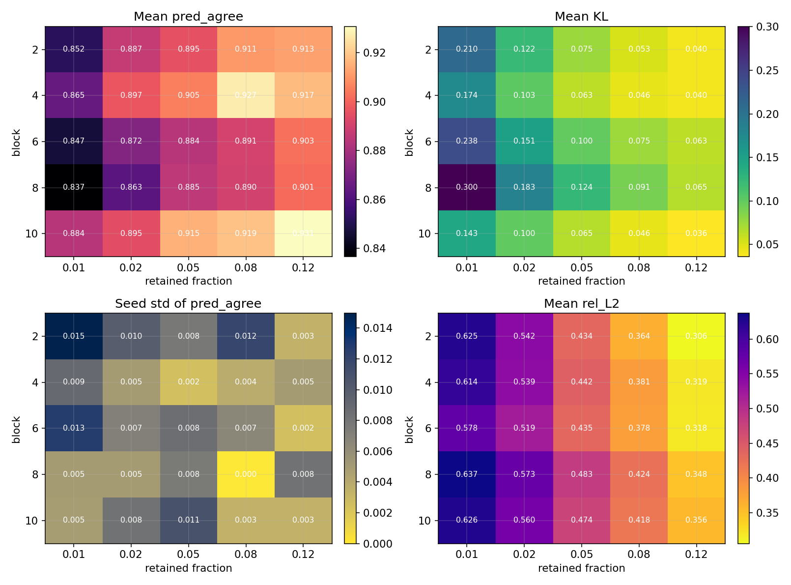

The heatmaps give the high-level picture:

- **mean prediction agreement** is strong over a broad region, not a single isolated point
- **KL** falls as the retained fraction increases
- **seed std** stays small on the best settings, which is exactly what we want for a paper-robust claim
- **relative reconstruction error** improves steadily with budget, but the best behavior-preserving settings are not determined by rel-L2 alone

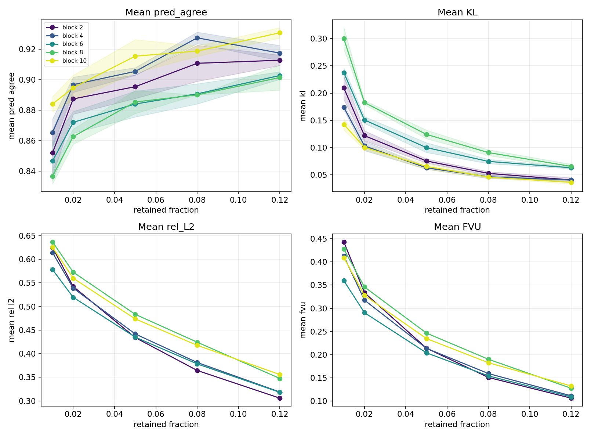

The curves show several useful qualitative patterns:

- average `pred_agree` improves almost monotonically as retained fraction grows
- the best aggregate block is **block 10** (`0.9087` mean `pred_agree` across all fractions), but **block 4** is also unusually strong
- blocks `6` and `8` underperform blocks `4` and `10`, suggesting that “deeper” alone is not the whole story

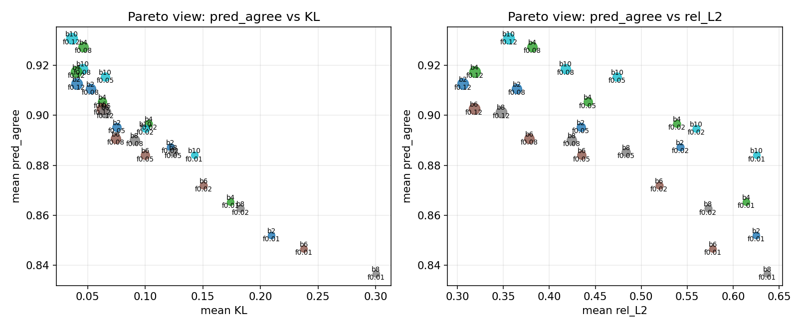

The Pareto plots make the main model-selection point clear: the strongest settings jointly achieve **high prediction agreement** and **low KL**, rather than winning on only one axis.

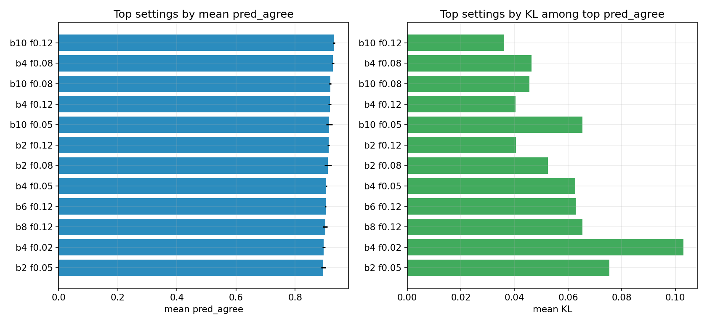

The best stable setting is:

- **block `10`, retained fraction `12%`**
- mean `pred_agree = 0.9307`
- seed std `= 0.0034`
- mean `KL = 0.0361`
- per-seed values `= 0.9260 / 0.9340 / 0.9320`
- gap to meaningful max `= 0.0693`

The strongest runner-up is:

- **block `4`, retained fraction `8%`**
- mean `pred_agree = 0.9273`
- seed std `= 0.0038`
- mean `KL = 0.0463`

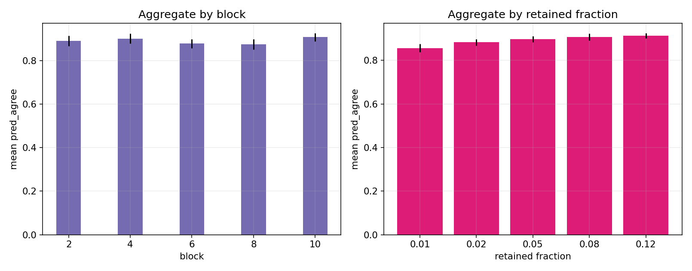

Aggregating across blocks and fractions reinforces the same story:

- by retained fraction: `1% → 0.8569`, `2% → 0.8827`, `5% → 0.8971`, `8% → 0.9075`, `12% → 0.9129`
- by retained fraction gap to max: `1% → 0.1431`, `2% → 0.1173`, `5% → 0.1029`, `8% → 0.0925`, `12% → 0.0871`
- by block: `2 → 0.8916`, `4 → 0.9024`, `6 → 0.8792`, `8 → 0.8752`, `10 → 0.9087`

Full mean table for every `ViT-small` `(block, retained fraction)` combination:

| Block | Retained | Mean Pred Agree | Seed Std | Mean KL |
|---|---:|---:|---:|---:|
| 2 | 1% | 0.8520 | 0.0150 | 0.2097 |
| 2 | 2% | 0.8873 | 0.0100 | 0.1218 |
| 2 | 5% | 0.8953 | 0.0077 | 0.0754 |
| 2 | 8% | 0.9107 | 0.0118 | 0.0525 |
| 2 | 12% | 0.9127 | 0.0034 | 0.0405 |
| 4 | 1% | 0.8653 | 0.0090 | 0.1740 |
| 4 | 2% | 0.8967 | 0.0050 | 0.1030 |
| 4 | 5% | 0.9053 | 0.0025 | 0.0627 |
| 4 | 8% | 0.9273 | 0.0038 | 0.0463 |
| 4 | 12% | 0.9173 | 0.0050 | 0.0403 |
| 6 | 1% | 0.8467 | 0.0127 | 0.2377 |
| 6 | 2% | 0.8720 | 0.0071 | 0.1507 |
| 6 | 5% | 0.8840 | 0.0085 | 0.0999 |
| 6 | 8% | 0.8907 | 0.0066 | 0.0745 |
| 6 | 12% | 0.9027 | 0.0025 | 0.0628 |
| 8 | 1% | 0.8367 | 0.0050 | 0.3004 |
| 8 | 2% | 0.8627 | 0.0050 | 0.1827 |
| 8 | 5% | 0.8853 | 0.0075 | 0.1241 |
| 8 | 8% | 0.8900 | 0.0000 | 0.0908 |
| 8 | 12% | 0.9013 | 0.0082 | 0.0653 |
| 10 | 1% | 0.8840 | 0.0049 | 0.1427 |
| 10 | 2% | 0.8947 | 0.0082 | 0.1002 |
| 10 | 5% | 0.9153 | 0.0109 | 0.0653 |
| 10 | 8% | 0.9187 | 0.0034 | 0.0456 |
| 10 | 12% | 0.9307 | 0.0034 | 0.0361 |

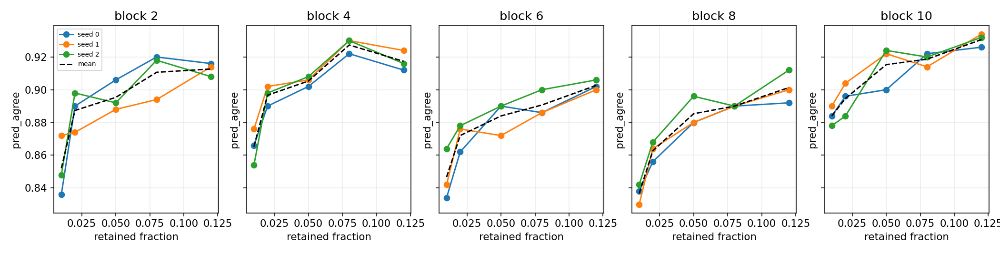

The per-seed traces show that the good settings are not just lucky winners. In particular, the top settings stay tightly clustered across all three seeds.

**T3.4 — completed ViT-base sweep on Imagenette (COMPLETE).** We then analyzed the larger-model sweep under `runs/vit_base_imagenette_full/`:

- model: `vit_base_patch16_224`
- blocks: `2, 4, 6, 8, 10`
- requested retained fractions: `2%, 5%, 8%, 12%`
- seeds: `0, 1, 2`
- total jobs: `60`

Every requested cell completed successfully (`60/60`). The meaningful maximum for `pred_agree` is again `1.0000`, since the metric is exact agreement with the original ViT prediction on each validation example.

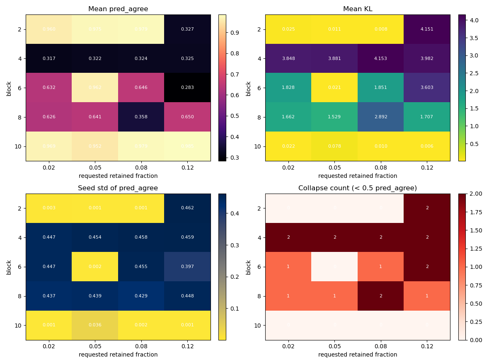

The larger-model heatmaps show a more dramatic story than the ViT-small sweep:

- **block 10** is an exceptionally strong stable regime
- several mid-block settings suffer outright **seed-collapse**
- seed variance and collapse count matter as much as the mean, because the raw sweep average is distorted by bimodal settings

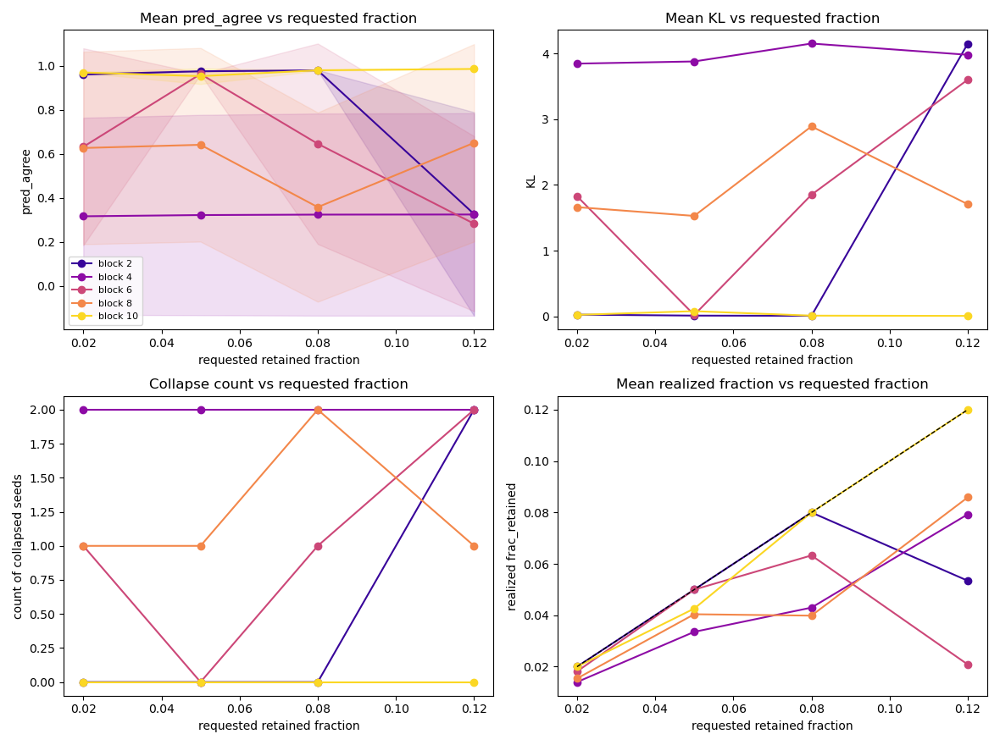

The curves make the instability visible:

- requested fraction does **not** behave monotonically in the raw aggregate on this run family
- the reason is not that higher budgets are intrinsically worse, but that some settings collapse on one or two seeds
- block `10` remains strong across all requested fractions, while blocks `4`, `6`, and `8` are much more fragile

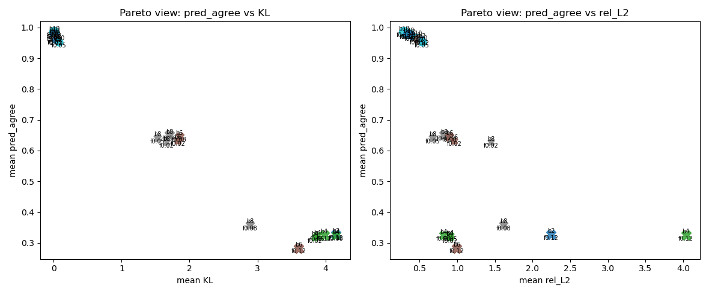

The Pareto plots isolate the true winners from the collapse-prone cells. The best stable settings are:

- **block `10`, requested `12%`**
- mean `pred_agree = 0.9851`
- seed std `= 0.0012`
- mean `KL = 0.0063`
- per-seed values `= 0.9857 / 0.9862 / 0.9834`
- gap to meaningful max `= 0.0149`

Strong runner-ups are:

- **block `10`, requested `8%`** with mean `pred_agree = 0.9790`
- **block `2`, requested `8%`** with mean `pred_agree = 0.9787`
- **block `2`, requested `5%`** with mean `pred_agree = 0.9745`

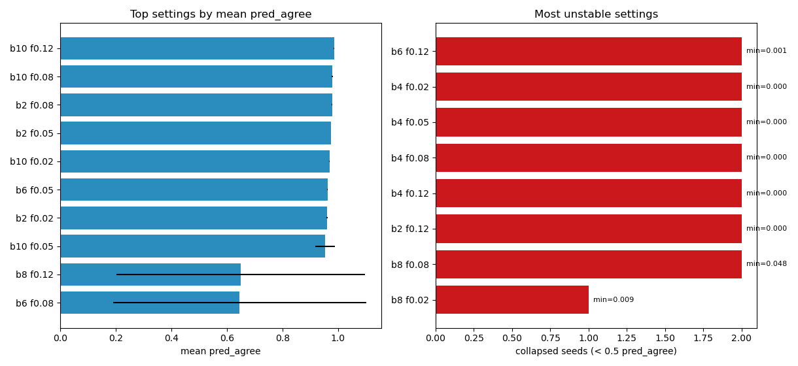

The ranking and instability summary show that the larger model is not simply "better everywhere." It is better in its stable regime, but much more brittle off-regime:

- by block: `2 → 0.8101`, `4 → 0.3220`, `6 → 0.6306`, `8 → 0.5689`, `10 → 0.9714`
- by requested fraction: `2% → 0.7009`, `5% → 0.7704`, `8% → 0.6572`, `12% → 0.5139`
- collapse-prone requested settings: `12 / 20`

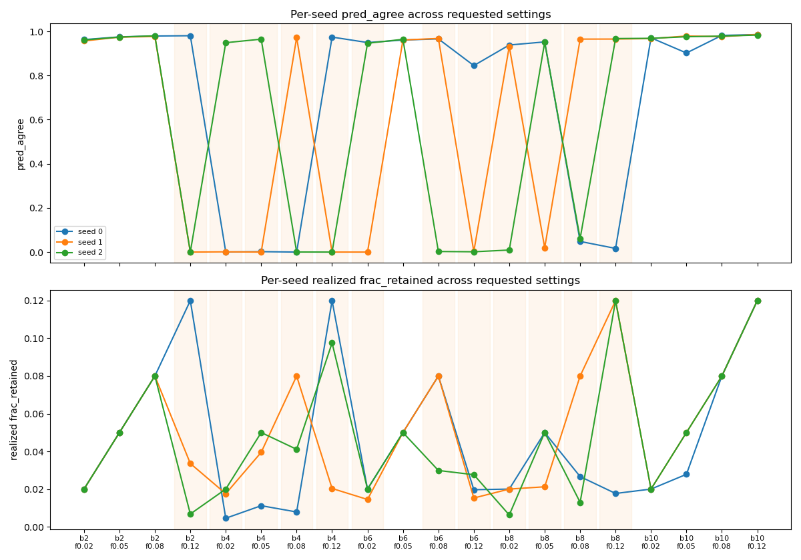

The seed traces are the key interpretive figure. They show a clear bimodal failure pattern in several settings, for example:

- `block 4, 12%`: `0.9743 / 0.0000 / 0.0000`
- `block 8, 12%`: `0.0166 / 0.9654 / 0.9676`
- `block 2, 12%`: `0.9804 / 0.0000 / 0.0003`
- `block 6, 8%`: `0.9661 / 0.9682 / 0.0025`

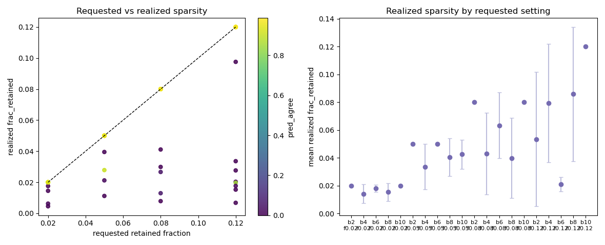

This is why the analysis groups by the **requested** retained fraction recovered from the run directory name rather than by rounding the realized `frac_retained` recorded in the JSON. Several collapse seeds retained far less than requested, for example:

- requested `5%`, block `10`, one seed realized only about `2.78%`
- requested `8%`, block `6`, one seed realized only about `2.99%`
- requested `12%`, block `2`, one seed realized only about `3.36%`

Full mean table for every `ViT-base` `(block, requested retained fraction)` combination:

| Block | Requested Retained | Mean Pred Agree | Seed Std | Mean KL | Collapsed Seeds |
|---|---:|---:|---:|---:|---:|
| 2 | 2% | 0.9602 | 0.0026 | 0.0254 | 0 |
| 2 | 5% | 0.9745 | 0.0006 | 0.0107 | 0 |
| 2 | 8% | 0.9787 | 0.0014 | 0.0077 | 0 |
| 2 | 12% | 0.3269 | 0.4621 | 4.1514 | 2 |
| 4 | 2% | 0.3167 | 0.4470 | 3.8476 | 2 |
| 4 | 5% | 0.3222 | 0.4544 | 3.8807 | 2 |
| 4 | 8% | 0.3242 | 0.4584 | 4.1534 | 2 |
| 4 | 12% | 0.3248 | 0.4593 | 3.9818 | 2 |
| 6 | 2% | 0.6319 | 0.4468 | 1.8281 | 1 |
| 6 | 5% | 0.9620 | 0.0015 | 0.0208 | 0 |
| 6 | 8% | 0.6456 | 0.4547 | 1.8513 | 1 |
| 6 | 12% | 0.2830 | 0.3975 | 3.6029 | 2 |
| 8 | 2% | 0.6265 | 0.4365 | 1.6623 | 1 |
| 8 | 5% | 0.6409 | 0.4393 | 1.5287 | 1 |
| 8 | 8% | 0.3582 | 0.4292 | 2.8919 | 2 |
| 8 | 12% | 0.6499 | 0.4478 | 1.7070 | 1 |
| 10 | 2% | 0.9690 | 0.0015 | 0.0222 | 0 |
| 10 | 5% | 0.9524 | 0.0355 | 0.0783 | 0 |
| 10 | 8% | 0.9790 | 0.0023 | 0.0101 | 0 |
| 10 | 12% | 0.9851 | 0.0012 | 0.0063 | 0 |

The larger-model conclusion is therefore two-sided: `ViT-Base` reaches a much stronger stable best-case regime than `ViT-small`, but it also exposes a new fragility story. The paper-robust claim here is not "larger is uniformly better"; it is "larger ViTs can support extremely faithful sparse token-grid reconstructions at the right late blocks, while many other settings become sharply seed-sensitive and deserve separate diagnosis."

### Tier follow-up status

| Item | Status |
|---|---|
| T1.1 N8 causal intervention | ✅ done |
| T1.2 architectural re-grounding | ✅ done (0.701) |
| T1.3 Q3→Q4 capacity | ✅ done (negative) |
| T2.2 Pareto sweep | ✅ done |
| T2.3 feature audit | ✅ done |
| T3.1 ResNet-110 backbone | ✅ done (73.25%) |
| T3.2 single ViT transfer artifact | ✅ done (0.944 pred_agree at 5%) |
| T3.3 full ViT-small sweep | ✅ done (75/75 jobs) |
| T3.4 full ViT-base sweep | ✅ done (60/60 jobs) |
| T2.1 R20/C10 recon + multi-seed | ⏳ pending node reboot |
| T2.4 transcoder taxonomy | ⏳ pending node reboot |
| T3.1 R110 recon | ⏳ pending node reboot |

The ViT-small sweep is therefore **not a failed experiment**. It is a real positive result: the sparse token-grid reconstruction story survives a full sweep and produces stable winner settings, with later blocks and larger retained fractions doing best overall.

*Resume after reboot:* `source env.sh && bash scripts/run_tier_rest_01.sh` (runs the remaining older pending items on GPUs 0,1).

---

## 5. How to reproduce

```bash
cd HIGH_DIM_PROJ && source env.sh         # cuDNN fix (project-local cu12 preload)
python scripts/train_backbone.py --arch resnet56 --dataset cifar100 --out runs/backbone_r56_c100
python src/cache_activations.py  --ckpt runs/backbone_r56_c100/best.pt --out runs/acts_r56_c100
python src/controls.py                                   # PCA baseline
python scripts/run_grid.py --phase phase1                # Phase 1 anchor (Vector+global)
python scripts/run_grid.py --phase phase2                # Phase 2 (Field, RF-local)
bash   scripts/run_phase3.sh                             # Phase 3 transitions
python src/eval_chain.py                                 # chain variants
python src/train_chain.py                                # Phase 3b Family II
python scripts/make_plots.py                             # regenerate figures
python scripts/make_plots_tiers.py                       # regenerate tier figures
python scripts/make_vit_sweep_figures.py                 # summarize completed ViT sweep
python scripts/make_vit_scale_figures.py --run-root runs/vit_base_imagenette_full --tag fig20_vit_base
```

Folder layout: `src/` (code), `scripts/` (drivers), `runs/` (checkpoints, caches, per-run `result.json`), `logs/` (collated logs + result files), `docs/` (per-phase result notes + design spec), `report/` (this report + `plots/`).

---

## 6. References

**Sparse autoencoders & sparsity mechanisms**
1. Olshausen & Field (1996). *Emergence of simple-cell receptive field properties by learning a sparse code for natural images.* Nature.
2. Bricken et al. (2023). *Towards Monosemanticity: Decomposing Language Models With Dictionary Learning.* Anthropic.
3. Templeton et al. (2024). *Scaling Monosemanticity.* Anthropic.
4. Gao et al. (2024). *Scaling and evaluating sparse autoencoders (TopK SAE).* OpenAI. arXiv:2406.04093.
5. Bussmann, Leask, Nanda (2024). *BatchTopK SAEs.* arXiv:2412.06410.
6. Rajamanoharan et al. (2024). *JumpReLU SAEs* (arXiv:2407.14435) and *Gated SAEs.* DeepMind.
7. Bussmann, Leask, Nanda (2025). *Learning Multi-Level Features with Matryoshka SAEs.* arXiv:2503.17547.
8. Heap et al. (2025). *Sanity Checks for Sparse Autoencoders: Do SAEs Beat Random Baselines?* arXiv:2602.14111.

**Vision SAEs (closest prior art)**
9. Lim, Choi, Choo, Schneider (2025). *PatchSAE: Sparse autoencoders reveal selective remapping of visual concepts during adaptation.* ICLR 2025. arXiv:2412.05276.
10. Stevens, Chao, Berger-Wolf, Su (2025). *Interpretable and Testable Vision Features via SAEs (saev).* arXiv:2502.06755.
11. *SAE-V: Sparse Autoencoders Learn Monosemantic Features in Vision-Language Models.* NeurIPS 2025. arXiv:2504.02821.
12. *Prisma / ViT-Prisma: An Open Source Toolkit for Mechanistic Interpretability in Vision and Video.* 2025. arXiv:2504.19475.
13. Olson et al. (2025). *Probing the Representational Power of Sparse Autoencoders in Vision Models.* ICCVW 2025.
14. *CaFE: Causal Interpretation of SAE Features in Vision.* 2025. arXiv:2509.00749.

**Convolutional / hierarchical sparse coding (classical ancestors)**
15. Zeiler, Taylor, Fergus (2011). *Adaptive Deconvolutional Networks for Mid and High Level Feature Learning.* ICCV.
16. Kavukcuoglu, Ranzato, LeCun (~2008–10). *Predictive Sparse Decomposition (PSD).*
17. Gregor & LeCun (2010). *Learning Fast Approximations of Sparse Coding (LISTA).* ICML.
18. Hosseini-Asl (2016). *Structured Sparse Convolutional Autoencoder (SSCAE).* arXiv:1604.04812.
19. Tolooshams et al. (2018–19). *CRsAE: Constrained Recurrent Sparse Auto-encoders.*
20. Makhzani & Frey (2015). *Winner-Take-All Autoencoders (CONV-WTA).*

**Cross-layer / hierarchical features (the hierarchy half)**
21. Dunefsky, Chlenski, Nanda (2024). *Transcoders Find Interpretable LLM Feature Circuits.* NeurIPS 2024. arXiv:2406.11944.
22. Lindsey, Templeton, Marcus, Conerly, Batson, Olah (2024). *Sparse Crosscoders for Cross-Layer Features and Model Diffing.* Anthropic.
23. Anthropic (2025). *Circuit Tracing / On the Biology of a Large Language Model* (Cross-Layer Transcoders).
24. Marks et al. (2024). *Sparse Feature Circuits.* ICLR 2025. arXiv:2403.19647.
25. *Interpreting Vision Transformers via Residual Replacement Model.* 2025. arXiv:2509.17401.
26. Bussmann et al. (2024). *Meta-SAEs.*  ·  *HSAE "Atoms to Trees"* and *Tree SAE* (2025–26) — hierarchical/tree-structured SAE features.

**Foundations**
27. Mallat (1989). *A theory for multiresolution signal decomposition: the wavelet representation.* IEEE TPAMI.
28. Candès, Romberg, Tao (2006). *Robust uncertainty principles (compressed sensing).* IEEE TIT.

*Note: a few 2026-dated preprints (Tree SAE, HSAE, Meta-SAE formalization, Sanity-Checks) were surfaced by search; verify exact author lists/venues before formal citation.*
